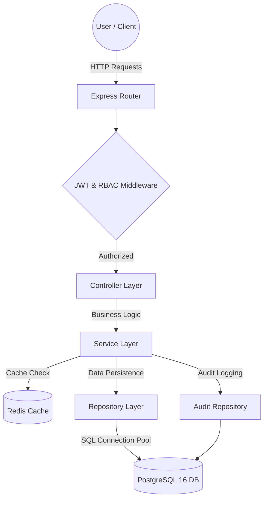

# 💊 MediVault - Enterprise Pharmacy & Healthcare Management Operating System

[](https://nodejs.org/)
[](https://expressjs.com/)
[](https://www.postgresql.org/)
[](https://redis.io/)
[](https://jwt.io/)
[](LICENSE)

**MediVault** is a next-generation pharmaceutical operating system designed for enterprise drug inventory control, multi-channel POS billing, automated expiry radar alerts, role-based access security (RBAC), and real-time security auditing. Built with a scalable **Layered Monolithic Architecture** (`Controllers -> Services -> Repositories -> Data Access`), MediVault leverages **PostgreSQL connection pooling**, **Redis read-aside caching**, atomic POS transactions, and exact numeric financial precision (`NUMERIC(12,2)`).

---

## 📋 Table of Contents
- [System Overview](#-system-overview)
- [Architecture & Layered System Flow](#-architecture--layered-system-flow)
- [Key Features](#-key-features)
- [Tech Stack](#-tech-stack)
- [Directory & Project Structure](#-directory--project-structure)
- [Default Demo Credentials](#-default-demo-credentials)
- [Installation & Quick Start](#-installation--quick-start)
- [Environment Variables](#-environment-variables)
- [API Endpoints Overview](#-api-endpoints-overview)
- [Data Backup & System Recovery](#-data-backup--system-recovery)
- [Future Enhancements](#-future-enhancements)
- [License](#-license)

---

## 🌟 System Overview

MediVault bridges the gap between pharmaceutical compliance, point-of-sale efficiency, and robust security. It automates inventory updates upon billing, tracks medicine expiration dates, enforces strict multi-role permissions, and logs every system operation to an immutable audit log.

```
       ┌─────────────────────────────────────────────────────────┐
       │                   Public Landing Page                   │
       └────────────────────────────┬────────────────────────────┘
                                    │ (Portal Authentication)
                                    ▼
       ┌─────────────────────────────────────────────────────────┐
       │              Role-Based Access Control (RBAC)           │
       └───────┬────────────────────┼────────────────────┬───────┘
               │                    │                    │
               ▼                    ▼                    ▼
       ┌───────────────┐    ┌───────────────┐    ┌───────────────┐
       │     ADMIN     │    │  PHARMACIST   │    │    CASHIER    │
       │ Full System & │    │  Inventory &  │    │  POS Billing  │
       │ Security Access│    │ Drug Control  │    │ Terminal Only │
       └───────────────┘    └───────────────┘    └───────────────┘
```

---

## 🏗️ Architecture & Layered System Flow

MediVault is structured as a clean, production-grade **Layered Monolith**:



- **Controller Layer**: Handles HTTP requests, input parameter extraction, and status codes.
- **Service Layer**: Implements core business logic, atomic transaction coordination, financial calculations (`Math.round(x * 100) / 100`), and Redis read-aside caching logic.
- **Repository Layer**: Encapsulates parameterized SQL queries and database connection management.
- **Cache Layer**: Redis read-aside caching for catalog queries (`medicines:all`) and system configuration (`settings:all`), with automatic pattern invalidation on mutations and seamless PostgreSQL fallback if Redis is unavailable.

---

## 🔥 Key Features

### 🔒 1. Role-Based Access Control (RBAC) & JWT Security
- Enforces strict security layers using **JSON Web Tokens (JWT)** and **bcrypt** password hashing.
- Three distinct user roles:
  - **System Admin**: Complete platform management, staff account registration, audit logs, and data backup/reset.
  - **Pharmacist**: Stock inventory management, drug entry, bulk CSV imports, POS billing, and reports.
  - **Cashier**: Isolated access to the POS billing terminal without settings or inventory modification rights.

### ⚡ 2. High-Performance PostgreSQL Connection Pooling
- Built on `pg` connection pool with configurable maximum pool size (`DATABASE_POOL_MAX`), connection timeouts (`DATABASE_CONNECTION_TIMEOUT`), and idle eviction timers (`DATABASE_IDLE_TIMEOUT`).
- B-tree indexing on frequently queried columns (`medicines.category`, `medicines.expiry_date`, `sales.sale_date`, `audit_logs.user_id`).

### 🚀 3. Redis Caching & Graceful Fallback
- **Read-Aside Strategy**: Frequent read operations check Redis first before querying PostgreSQL.
- **Cache Invalidation**: Mutations (adding, updating, deleting medicines or settings) invalidate related cache keys (`medicines:*`, `settings:*`).
- **Graceful Fallback**: If Redis service is offline, MediVault logs a warning and transparently serves queries directly from PostgreSQL without downtime.

### 💳 4. Multi-Payment POS Billing & Atomic Transactions
- Atomically executes checkout inside single SQL transactions (`BEGIN` ... `COMMIT` / `ROLLBACK`).
- Prevents stock overselling via conditional atomic SQL decrements (`UPDATE medicines SET quantity = quantity - $1 WHERE id = $2 AND quantity >= $1`).
- Accurate financial calculations with `NUMERIC(12,2)` columns and exact rounded service-layer arithmetic.

### 🆔 5. Standardized Dynamic ID Engine
- Automatically formats business records with standardized prefix identifiers:
  - **Medicines**: `MED-2026-xxx`
  - **Sales Invoices**: `INV-2026-xxx`
  - **Staff User Accounts**: `USR-xxx`
  - **Suppliers**: `SUP-xxx`

### 🗄️ 6. System Data Backup & Recovery
- **Export JSON Snapshot**: Download complete database backup files.
- **Restore JSON Snapshot**: Upload and restore previous system database snapshots.
- **Factory Reset**: Password-verified Admin database wipe & re-seeding.

---

## 💻 Tech Stack

| Component | Technology | Description |
|---|---|---|
| **Backend Runtime** | Node.js (v20+) | Event-driven JavaScript runtime |
| **Web Framework** | Express.js (v4.x) | Fast REST API framework |
| **Authentication** | JWT & bcryptjs | Stateless JSON Web Tokens & salted password hashing |
| **Database** | PostgreSQL (v16.x) | Enterprise relational database with `pg` connection pooling |
| **Cache Store** | Redis (v7.x) | High-performance in-memory key-value cache |
| **Frontend UI** | HTML5, CSS3, Vanilla JS | SPA architecture with dark/light glassmorphism design system |
| **PDF Generation** | html2pdf.js | Native browser printable PDF invoice generator |

---

## 📁 Directory & Project Structure

```
MediVault/
├── database/
│   └── migrations/
│       ├── 001_initial_schema.sql    # DDL schema for users, medicines, sales, items, audit, settings
│       └── 002_indexes.sql           # Performance B-Tree indexes
├── docs/
│   ├── ARCHITECTURE.md               # Monolithic layer specifications & data flow
│   ├── CONCURRENCY.md                # POS checkout atomicity & stock guard strategy
│   ├── DATABASE_INDEXING.md          # Indexing rationale & query execution plans
│   ├── DATABASE_MIGRATION.md         # SQLite to PostgreSQL migration guide
│   ├── DEPLOYMENT.md                 # Production deployment & Docker guidelines
│   ├── REDIS.md                      # Read-aside caching & invalidation rules
│   └── SCALABILITY.md                # Connection pooling & performance benchmarks
├── public/
│   ├── css/
│   │   └── style.css                 # Design system tokens, light/dark themes
│   ├── js/
│   │   ├── auth.js                   # JWT authentication, session storage & RBAC gating
│   │   └── script.js                 # SPA navigation, POS billing, stat card modals
│   └── index.html                    # Dashboard, billing terminal & modals
├── scripts/
│   └── migrate-sqlite-to-postgres.js # Automated ETL migration utility
├── src/
│   ├── config/
│   │   ├── migratePostgres.js        # DDL migration runner & demo data seeder
│   │   ├── postgres.js               # PostgreSQL connection pool manager
│   │   └── redis.js                  # Redis client, read-aside helper & fallback logic
│   ├── controllers/                  # Express HTTP request & status handlers
│   ├── middlewares/                  # JWT auth & RBAC permission gates
│   ├── repositories/                 # Parameterized SQL query abstraction layer
│   ├── services/                     # Business logic, transactions & Redis cache rules
│   ├── routes/                       # Express router endpoints
│   └── app.js                        # Middleware, routes, & GET /api/health endpoint
├── server.js                         # Application entry point
├── docker-compose.yml                # Production PostgreSQL 16 & Redis 7 services
├── package.json                      # Project dependencies & npm scripts
└── README.md                         # System documentation
```

---

## 🔑 Default Demo Credentials

When the server boots for the first time, it automatically seeds three default team accounts:

| Role | Email Address | Password | Permissions |
|---|---|---|---|
| **System Admin** | `admin@medivault.com` | `admin123` | Full access (Inventory, Sales, Users, Audit Logs, Settings) |
| **Pharmacist** | `pharmacist@medivault.com` | `pharm123` | Inventory, Drug Entry, Bulk CSV, Sales, Reports |
| **Cashier** | `cashier@medivault.com` | `cash123` | POS Sales & Billing Terminal only |

---

## 🚀 Installation & Quick Start

### Prerequisites
- [Node.js](https://nodejs.org/) (v18.0.0 or higher)
- [PostgreSQL](https://www.postgresql.org/) (v16.x) or [Docker Desktop](https://www.docker.com/)
- [Redis](https://redis.io/) (v7.x - optional for caching)

### 1. Clone & Install
```bash
git clone https://github.com/G-Gowthamr/MediVault--Enterprise-Pharmacy-And-Inventory-Operating-System.git
cd MediVault--Enterprise-Pharmacy-And-Inventory-Operating-System
npm install
```

### 2. Configure Environment
Create `.env` in the root directory:
```env
PORT=3000
NODE_ENV=development
JWT_SECRET=your_super_secret_jwt_key_2026

# PostgreSQL Connection
PGHOST=localhost
PGPORT=5432
PGDATABASE=medivault
PGUSER=postgres
PGPASSWORD=your_password
DATABASE_POOL_MAX=10

# Redis Caching (Optional)
REDIS_ENABLED=true
REDIS_HOST=127.0.0.1
REDIS_PORT=6379
```

### 3. Start PostgreSQL & Redis via Docker (Optional)
```bash
docker compose up -d
```

### 4. Start MediVault Server
```bash
npm start
```

### 5. Access the Application
Open your web browser and navigate to `http://localhost:3000`.

---

## 📡 API Endpoints Overview

### Health & Monitoring
- `GET /api/health` - Check PostgreSQL database & Redis cache system status.

### Authentication & Users
- `POST /api/auth/login` - Authenticate user & receive JWT token.
- `GET /api/auth/me` - Get current logged-in user profile.
- `GET /api/auth/users` - List all staff accounts *(Admin Only)*.
- `POST /api/auth/users` - Create a new staff account *(Admin Only)*.

### Drug Inventory Management
- `GET /api/medicines` - Fetch all pharmaceutical inventory products (Redis cached).
- `POST /api/medicines` - Add a new medicine record (invalidates cache).
- `PUT /api/medicines/:id` - Update medicine details (invalidates cache).
- `DELETE /api/medicines/:id` - Delete a medicine record *(Admin Only)*.
- `POST /api/medicines/upload-csv` - Import bulk CSV batch file.

### POS Sales & Invoicing
- `GET /api/sales` - Get all sales transactions.
- `POST /api/sales` - Process a new customer checkout transaction (atomic SQL transaction).

### Settings & Maintenance
- `GET /api/settings` - Retrieve system preferences (Redis cached).
- `POST /api/settings` - Save updated preferences (invalidates cache).
- `GET /api/settings/backup` - Export JSON system backup file *(Admin Only)*.
- `POST /api/settings/restore` - Restore JSON system backup file *(Admin Only)*.
- `POST /api/settings/reset` - Password-verified database reset *(Admin Only)*.

---

## 🔮 Future Enhancements

- 📱 **Mobile App Integration**: React Native mobile app for barcode scanning.
- 📦 **Supplier Reorder Automation**: Automated purchase order generation when stock hits threshold.
- 🔔 **WhatsApp / SMS Invoicing**: Send digital receipts directly to customer phone numbers.
- 📈 **Advanced Predictive Analytics**: Machine-learning demand forecasting for seasonal medicine trends.

---

## 📜 License

This project is open-source software licensed under the [MIT License](LICENSE).

Developed with ❤️ by **[Gowtham R](https://github.com/G-Gowthamr)**.

